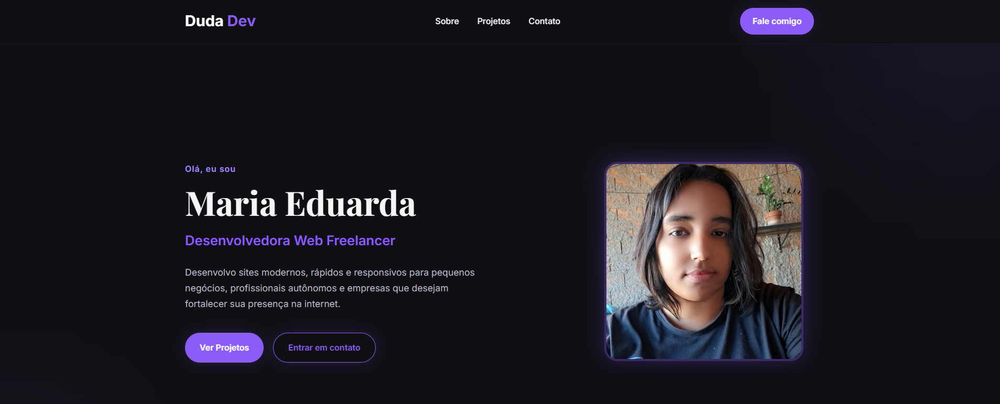

# Duda Dev | Portfólio

## Sobre o projeto

Este é o meu portfólio pessoal como Desenvolvedora Web Freelancer. O projeto foi desenvolvido para apresentar minhas habilidades, projetos e formas de contato de maneira moderna, responsiva e intuitiva, servindo como meu cartão de visitas na web.

## Preview

<!-- Adicione uma imagem do projeto -->


-- ou --

[Ver projeto ao vivo](https://dudamilannnn.github.io/portfolio/)

## Funcionalidades

- Header fixo com navegação entre as seções
- Hero com apresentação e chamada para ação
- Seção "Sobre" com informações e habilidades
- Cards de projetos com links para demonstração e GitHub
- Seção de contato com redes sociais
- Layout responsivo para desktop, tablet e celular
- Animações suaves durante a navegação
- Scroll suave entre as seções

## Tecnologias utilizadas

- HTML5
- CSS3
- JavaScript (ES6)
- Google Fonts
- Font Awesome

## Estrutura do projeto

```text
portfolio/
│
├── index.html
├── css/
│   └── style.css
├── js/
│   └── script.js
├── assets/
│   └── img/
└── README.md
```

## Como executar o projeto

1. Faça o download ou clone este repositório.
2. Abra a pasta do projeto.
3. Execute o arquivo `index.html` em seu navegador.

Ou utilize a extensão **Live Server** no Visual Studio Code para uma melhor experiência durante o desenvolvimento.

## Aprendizados

Durante o desenvolvimento deste projeto foram praticados conceitos como:

- Estruturação semântica com HTML5
- Flexbox e CSS Grid
- Responsividade
- Organização de código
- Manipulação do DOM com JavaScript
- Scroll suave e animações
- Boas práticas de desenvolvimento Front-end

## Melhorias futuras

- Adicionar modo claro/escuro
- Implementar formulário de contato
- Adicionar filtro de projetos
- Melhorar as animações
- Integrar com um serviço de envio de e-mails

## Autor

Desenvolvido por **Duda Dev**.

- GitHub: https://github.com/dudamilannnn
- Instagram: https://instagram.com/dudadev